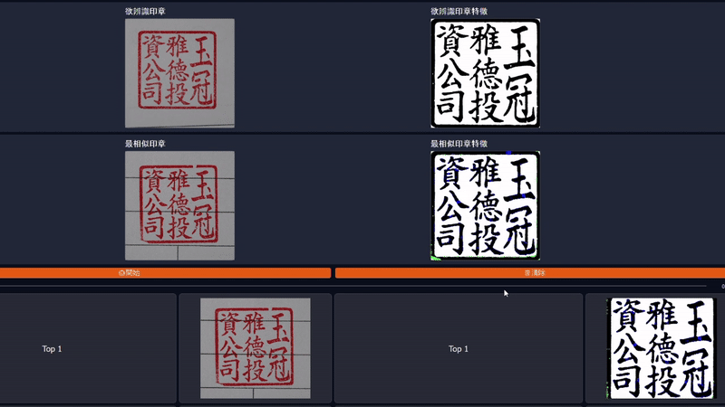

# Image Similarity and Analysis Tool

This project provides a desktop GUI application built with PySide6 that performs image similarity comparisons and analysis on scanned images (e.g., stamp images). The application is designed to help users identify and compare similar images within pre-defined categories.

## Features

- Graphical User Interface (GUI):
    
    The main window is built using PySide6 and features a scrollable area, interactive buttons, and multiple display labels for images. The UI provides a user-friendly means to load images and view comparison results.

- Image Loading and Preprocessing: 
    
    * PIL and OpenCV Integration: The code uses Python Imaging Library (PIL) and OpenCV for loading, converting (e.g., from color to grayscale), and resizing images.

    * Binarization: Images are converted to binary (black and white) using a specified threshold (default 127) to help standardize comparisons.

* Database and Category Management:

    - Category Mapping: A pickle file (file_category_mapping.pkl) stores mappings between image filenames and their corresponding categories.
    - Dynamic Category Selection: If an image does not have a pre-mapped category, the application prompts the user to select an appropriate category from available options.
    - Image Organization: The application loads images from two folders: one for black & white images and one for the original images. The folder structure supports categorization.
- Similarity Calculation and Comparison:

    - Hash-Based Filtering: The tool uses perceptual hashing (pHash) via the imagehash module to quickly rule out the image being compared against itself.
    - Pixel-Based Comparison: After binarization, similarity is computed by comparing pixel values between a test image and each database image, where the percentage of matching pixels is calculated.
    - Ranking: Images within the selected category are sorted based on their similarity scores. The top three most similar images are then displayed along with their original and processed versions.
- Detailed Analysis and Visual Feedback:

    - Difference Highlighting: The application highlights differences between images by overlaying colored markers on the processed images. The outer contour differences are marked in red, and inner differences are highlighted in green.
    - Metric Calculation:
        - Total and different pixel counts
        - Difference percentage
    - Font and Spacing Comparison: Additional analysis includes using Hu Moments to estimate font differences and projection-based metrics (mean squared error) to assess differences in spacing.


## Deployment

Clone the project

```bash
  git clone https://github.com/KasymovD/seal_scan_aoi.git
```

Go to the project directory

```bash
  cd seal_scan_aoi
```

Install dependencies

```bash
  pip install -r requirements.txt
```

Create pickle file

```bash
  python generate_mapping.py
```

Start the GUI project

```bash
  python main.py
```
## Demo




## License

This work is licensed under [MIT](https://choosealicense.com/licenses/mit/)

